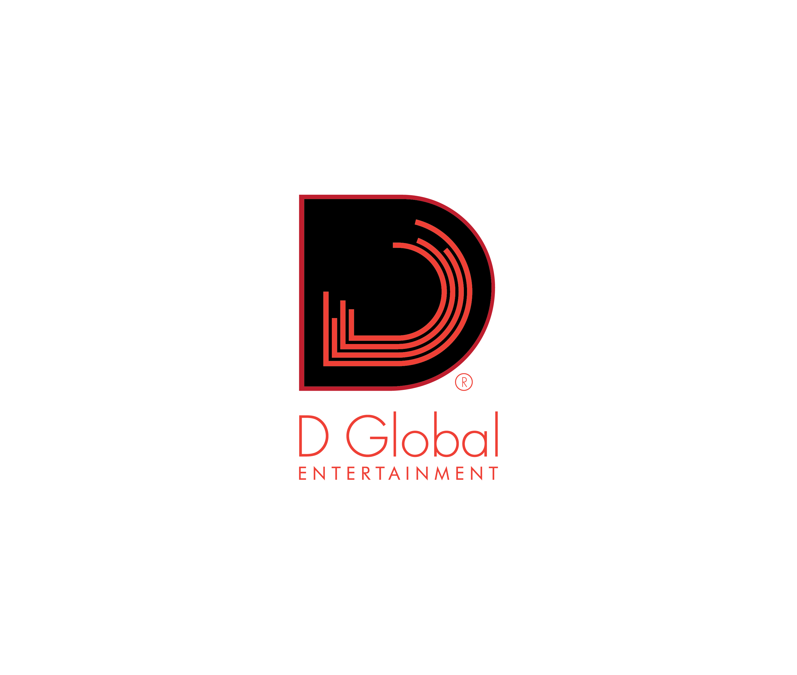

# D-Global

> **Digital nightlife ecosystem** — events discovery, VIP table booking, and a record label home. Built for Accra, engineered to scale.



---

## What this is

D-Global is a production-grade Next.js platform that combines three products into one immersive brand experience:

1. **Events** — browse, countdown, and buy tickets (Early Bird / Regular / VIP).
2. **VIP Tables** — Silver / Gold / Platinum packages with a WhatsApp-first booking flow (critical for Ghana).
3. **Record Label** — artist profiles, releases, Spotify/Audiomack embeds, and a carousel of featured acts.

It is not a website. It is a night you can step inside from any device.

---

## Stack

| Layer | Choice |
|---|---|
| Framework | **Next.js 15** (App Router, RSC-first) |
| Language | **TypeScript** (strict, `noUncheckedIndexedAccess`) |
| Database | **PostgreSQL** via **Prisma** |
| Styling | **Tailwind CSS** + custom CSS variables + `tailwindcss-animate` |
| Motion | **Framer Motion** (`Reveal`, hero entrance) |
| Forms | **zod** schemas + React 19 `useActionState` / Server Actions |
| Payment | **Paystack** (Ghana-first: MoMo + card); optional "link" mode for zero-backend launch |
| Carousels / Lightbox | `embla-carousel-react`, `yet-another-react-lightbox` |
| QR | `qrcode` (server-side, HMAC-signed payload) |

---

## Folder layout

```
app/                      Next.js App Router
  (marketing)/           → /about, /contact route group
  events/                → /events, /events/[slug], /events/[slug]/tickets
  bookings/              → VIP table booking + confirmation
  artists/               → /artists, /artists/[slug]
  releases/              → /releases, /releases/[slug]
  gallery/               → Gallery with category chips + lightbox
  tickets/[orderId]/     → Post-purchase QR display
  api/                   → checkout, webhooks, qr, bookings, health
components/              Cross-feature presentational components
  ui/                    → Button, Card, Badge, Input, Select, Skeleton
  layout/                → Header, Footer, MobileMenu, StickyMobileBar
  brand/                 → Logo
  motion/                → Reveal (framer-motion wrapper)
features/                Domain slices (queries + components colocated)
  events/
  tickets/
  bookings/
  artists/
  releases/
  gallery/
  home/                  → VideoHero, UpcomingEventsGrid, VIPStrip, etc.
lib/                     Shared utils (env, site, whatsapp, date, currency)
server/                  Pure server-only (db, paystack, qr signing, auth stub)
prisma/                  Schema + seed
public/                  Favicons, webmanifest, brand logo, image/video assets
fonts/                   AtypDisplay + AtypText TTFs (loaded via next/font/local)
```

---

## Getting started

### Prerequisites

- Node.js **20+**
- pnpm 9+ (or npm / yarn)
- PostgreSQL 15+ (local, Docker, or managed)

### 1. Install

```bash
pnpm install
```

### 2. Configure environment

```bash
cp .env.example .env.local
```

Fill in at minimum:
- `DATABASE_URL` — your Postgres connection string.
- `NEXT_PUBLIC_WHATSAPP_NUMBER` — Ghana number in E.164 without `+` (e.g. `233241234567`).
- `QR_SECRET` — any long random string (HMAC key for ticket integrity).

Optional (only if you want live payments):
- `PAYSTACK_MODE=api` plus `PAYSTACK_SECRET_KEY`.
- Leave as `PAYSTACK_MODE=link` to use hosted Paystack Payment Links (per `TicketType.paymentLinkUrl`).

### 3. Database

```bash
pnpm prisma migrate dev --name init
pnpm db:seed
```

Seeds: 3 events, 3 VIP packages (Silver/Gold/Platinum), 4 artists, 3 releases, 12 gallery images.

### 4. Run

```bash
pnpm dev
```

Open [http://localhost:3000](http://localhost:3000).

---

## Verifying end-to-end

| URL | What you should see |
|---|---|
| `/` | Full-screen immersive hero, upcoming events grid, VIP strip, artist carousel, gallery preview, sticky mobile bar (≤ md) |
| `/events` | 3 seeded events with `?when` / `?genre` / `?city` filter chips |
| `/events/accra-labs-vol-07` | Hero, countdown, description, lineup, Google Maps embed, sticky ticket card |
| `/events/accra-labs-vol-07/tickets` | Ticket tier selector with qty steppers; "Pay with Paystack" (link mode) or full checkout (api mode) |
| `/bookings` | 3 packages, booking form, WhatsApp-prefilled deep link |
| `/bookings/confirmation?code=...` | Booking reference + "Continue on WhatsApp" |
| `/artists` | Grid of 4 artists |
| `/artists/kwesi-nyame` | Hero, bio, Spotify embed, discography, upcoming shows |
| `/releases` / `/releases/night-capital` | Release list + detail with tracklist and embeds |
| `/gallery` | Category chips (Events / Backstage / Artists / Venue / Campaign), click → full-screen lightbox |
| `/api/health` | `{ ok: true }` |

---

## Payment flow (Paystack)

- **Link mode (`PAYSTACK_MODE=link`)**: Checkout redirects to a hardcoded Paystack Payment Link (stored per `TicketType.paymentLinkUrl`). Zero backend configuration required to sell tickets.
- **API mode (`PAYSTACK_MODE=api`)**:
  1. `POST /api/checkout/paystack` validates cart, re-prices from DB, creates a `PENDING` Order, calls `/transaction/initialize`, returns `authorization_url`.
  2. User completes payment on Paystack's hosted page.
  3. Paystack fires `POST /api/webhooks/paystack`. We verify the `x-paystack-signature` HMAC (SHA-512 of the raw body), flip the Order to `PAID`, create HMAC-signed `qrToken` per `OrderItem`, increment `sold` counters.
  4. User lands on `/tickets/[orderId]` which renders QR codes via `/api/tickets/[orderId]/qr?item=...&t=...`.

---

## WhatsApp integration

Every booking flow has a WhatsApp deep-link fallback (`https://wa.me/<number>?text=<prefilled>`). The booking form pre-fills: package, party size, event, name, and the generated booking code. Configure the business number via `NEXT_PUBLIC_WHATSAPP_NUMBER`.

---

## Design system

- **Palette (HSL CSS vars):** `--bg` #000, `--surface` #1A1A1A, `--elevated` #242424, `--accent` #C00000, `--fg` #FFF, `--muted` #B3B3B3.
- **Fonts:** `AtypDisplay` for headings, `AtypText` for body, loaded via `next/font/local`.
- **Utilities:** `.glow-red` (red hover glow), `.card-lift` (-4px translate + shadow on hover), `.gradient-radial-red`.
- **Motion:** subtle fade/slide on scroll via `Reveal`; `prefers-reduced-motion` respected.

---

## Future milestones (scaffolded, not implemented)

- **NextAuth** — `server/auth.ts` stub ready; add `/admin/*` routes in a follow-up.
- **Admin dashboard** — for events, packages, artists, gallery uploads (Cloudinary).
- **Transactional mail** — `server/mailer.ts` stub; wire Resend/Postmark for order receipts.
- **Analytics** — `lib/analytics.ts` no-op; plug Plausible or PostHog.
- **Push notifications** — PWA manifest is already in place.

---

## Scripts

| Command | Description |
|---|---|
| `pnpm dev` | Run dev server |
| `pnpm build` | Generate Prisma client + production build |
| `pnpm start` | Run production build |
| `pnpm lint` | ESLint |
| `pnpm typecheck` | TypeScript `--noEmit` |
| `pnpm prisma:migrate` | `prisma migrate dev` |
| `pnpm prisma:studio` | Prisma Studio |
| `pnpm db:seed` | Seed the DB |

---

## License

Proprietary. © D-Global, Accra.
